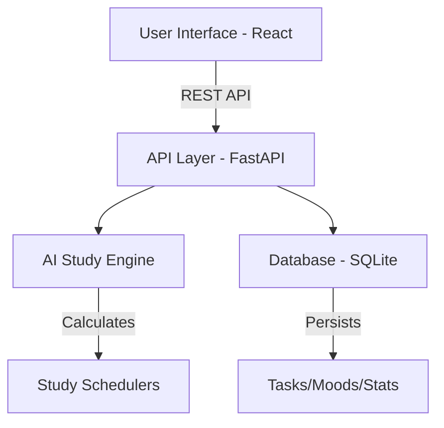

# 🎓 Study Hub / AI Planner

<div align="center">


[](https://fastapi.tiangolo.com/)
[](https://reactjs.org/)
[](https://www.sqlite.org/)
[](https://vitejs.dev/)
[](https://github.com/NadaRamadan/Adaptive-AI-Study-Planner-)

**The ultimate productivity powerhouse for CS & AI students. Organize your academic life with AI-driven precision.**

[Explore Features](#-key-features) • [Get Started](#-installation--setup) • [Architecture](#-system-architecture)

</div>

---

## 🚀 Overview

**Study Hub** is an adaptive academic organizer designed to transform the chaotic student schedule into a streamlined, high-performance workflow. By combining **Glassmorphism aesthetics** with **AI-powered prioritization**, it helps you stay ahead of deadlines while prioritizing your mental well-being.

### ✨ Key Features

- 🧠 **AI Study Engine**: Automatically calculates study hours, Pomodoro cycles, and priority levels based on task difficulty and deadlines.
- 🎨 **Glassmorphism Dashboard**: A premium, interactive UI with dark/light mode support and smooth micro-animations.
- 📅 **Adaptive Schedule**: Interactive Saturday-Friday grid with context-aware modals for Lectures and Sections.
- 🎮 **Gamification**: Earn points, build study streaks, and level up your productivity.
- 🧘 **Mental Health Integration**: Mood tracking, daily reflections, and AI-suggested mindful breaks.
- 📊 **Unified Resource Hub**: Centralized access to YouTube lectures, Drive notes, and community links.
- ⏱️ **Focus Mode**: Integrated Pomodoro timer with motivational AI tips.

---

## 🛠️ Tech Stack

- **Frontend**: `React 18`, `Vite`, `Framer Motion`, `Lucide React`, `Vanilla CSS (Glassmorphism)`
- **Backend**: `FastAPI`, `SQLAlchemy`, `Uvicorn`, `Pydantic`
- **Database**: `SQLite` (Lightweight and portable)
- **AI Logic**: Custom heuristics for adaptive study session distribution.

---

## 📦 Installation & Setup

### Prerequisites

- Python 3.9+
- Node.js 16+
- npm

### 1. Clone the repository

```bash
git clone https://github.com/NadaRamadan/Adaptive-AI-Study-Planner-.git
cd Adaptive-AI-Study-Planner-
```

### 2. Backend Setup

```bash
# Navigate to root
python -m venv venv
source venv/bin/activate  # On Windows: venv\Scripts\activate
pip install -r backend/requirements.txt
```

### 3. Frontend Setup

```bash
cd frontend
npm install
```

### 4. Running the Application

**Backend:**

```bash
# From root
python -m uvicorn main:app --port 8000 --app-dir backend
```

**Frontend:**

```bash
# From frontend directory
npm run dev
```

---

## 📐 System Architecture



---

## 🤝 Contributing

Contributions are what make the open source community such an amazing place to learn, inspire, and create. Any contributions you make are **greatly appreciated**.

1. Fork the Project
2. Create your Feature Branch (`git checkout -b feature/AmazingFeature`)
3. Commit your Changes (`git commit -m 'Add some AmazingFeature'`)
4. Push to the Branch (`git push origin feature/AmazingFeature`)
5. Open a Pull Request

---

## 📝 License

Distributed under the MIT License. See `LICENSE` for more information.

<div align="center">
  Built with ❤️ by Nada Ramadan
</div>
